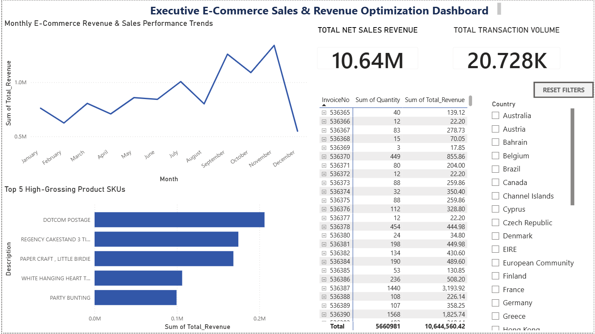

# Executive E-Commerce Sales & Revenue Optimization Dashboard

## 📌 Project Preview
Below is a high-resolution snapshot of the final interactive dashboard canvas. Technical hiring managers can download the raw `ecommerce-sales-analytics.pbix` file from this repository to review the full relational data model, internal documentation logs, and active DAX formulas locally.

## 🎯 Project Overview
This Business Intelligence (BI) solution delivers an interactive executive-level dashboard tracking $10.64M in transactions for a global e-commerce retailer. The solution bridges the gap between digital web activity and financial metrics, optimizing tracking layouts to isolate high-grossing products, seasonal revenue trends, and international performance sales funnels.

## 🛠️ Data Engineering & Cleaning Steps (Power Query)
* **Operational Integrity**: Structured data filters to isolate active sales cycles by removing transactional returns and order cancellations (Quantity ≤ 0).
* **Global Schema Alignment**: Engineered an advanced Locale Transformation (English-US format conversion) to resolve cross-regional text mismatches across 300,000+ localized date string rows.
* **Calculated Business Logic (DAX)**: Programmed a granular calculated column layer multiplying unit cost against quantity scales to map exact row-level Gross Revenue.

## 💡 Executive Insights & Business Value
* **International Market Concentration**: The United Kingdom stands as the primary financial driver, generating the overwhelming majority of global net sales revenue. 
* **Seasonal Sales Cycles**: Timeline trends indicate a significant spike in transaction volume during late Q4 (November/December), aligning with holiday shopping metrics.
* **Product Efficiency**: Isolated the top 5 highest-grossing product SKUs using complex Top-N visual filters, allowing supply chain managers to optimize inventory control.

## 🚀 Technical Features Included
* **Interactive Slicers**: Dynamic cross-filtering by country across all visuals.
* **State Bookmarks**: Custom-programmed 'Reset Filters' buttons to optimize user experience.
* **Granular Matrix Ledgers**: Deep drill-down capability from individual invoice sheets down to exact product line-items.
# ecommerce-revenue-optimisation-bi
